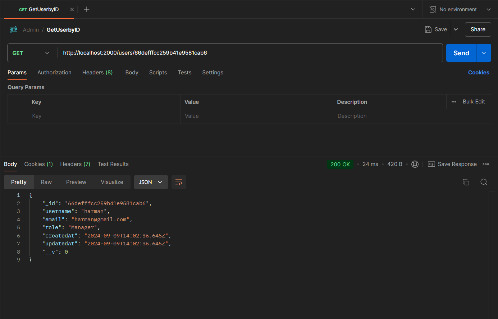

# Admin Panel API

## Overview

The Admin Panel API facilitates user and project management with three distinct roles: Admin, Manager, and Employee.

- **Admin**: Creates new users, assigns roles, and manages existing users and projects.
- **Manager**: Manages projects and assigns employees to them.
- **Employee**: Views projects they are assigned to.

## Endpoints


### Authentication

#### Signup

- **Endpoint:** `POST /auth/signup`
- **Description:** Creates the Admin user. Only one Admin user can be created.
- **Request Body:**
  ```json
  {
    "username": "string",
    "email": "string",
    "password": "string"
  }
  ```
  

### Register User
http://localhost:2000/auth/register
Register User (POST /auth/register): Allows the Admin to register new users. (Only Admin can access this route.)


### Login
http://localhost:2000/auth/login
Login (POST /auth/login): Allows users to log in with their credentials (username and password) and receive a JWT token for authentication.


### Get Users
http://localhost:2000/users
Get Users (GET /users): Accessible by Admin and Manager. Retrieves a list of all users.


### Get User by ID
http://localhost:2000/users/66defffcc259b41e9581cab6
Get User by ID (GET /users/:id): Accessible by all users. Retrieves the details of a specific user.


### Update User
http://localhost:2000/users/66defffcc259b41e9581cab6
Update User (PUT /users/:id): Accessible by Admin. Updates the information of a specific user.


### Delete User
http://localhost:2000/users/66defffcc259b41e9581cab6
Delete User (DELETE /users/:id): Accessible by Admin, Soft Deletes a user.


### assign-role
http://localhost:2000/users/66defffcc259b41e9581cab6/assign-role
Assign Role to User (POST /users/:id/assign-role): Allows the Admin to assign a role to a user.


### Create Project
http://localhost:2000/Project
Create Project (POST /project): Accessible by Admin. Creates a new project that users can be assigned to.


### Get Projects
http://localhost:2000/Project
Get Projects (GET /project): Accessible by all users. Retrieves a list of projects available to the user based on their role.


### GetProjectbyID
http://localhost:2000/Project/66df0a70cf0cc576367cc2c1
Get Project by ID (GET /project/:id): Accessible by all users. Retrieves the details of a specific project.


### Update Project
http://localhost:2000/Project/66df0a70cf0cc576367cc2c1
Update Project (PUT /project/:id): Accessible by Admin. Updates the details of a project.


### Delete Project
http://localhost:2000/Project/66df0a70cf0cc576367cc2c1
Delete Project (DELETE /project/:id): Accessible by Admin. Soft deletes a project.

